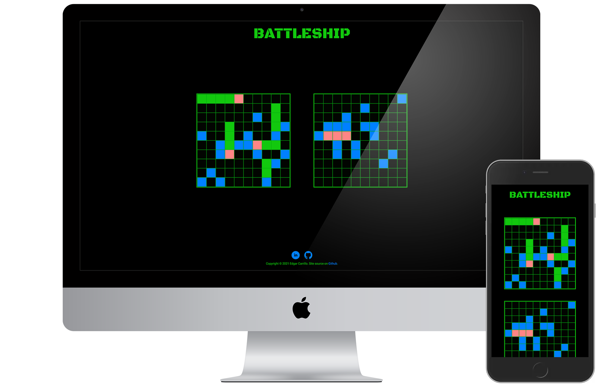
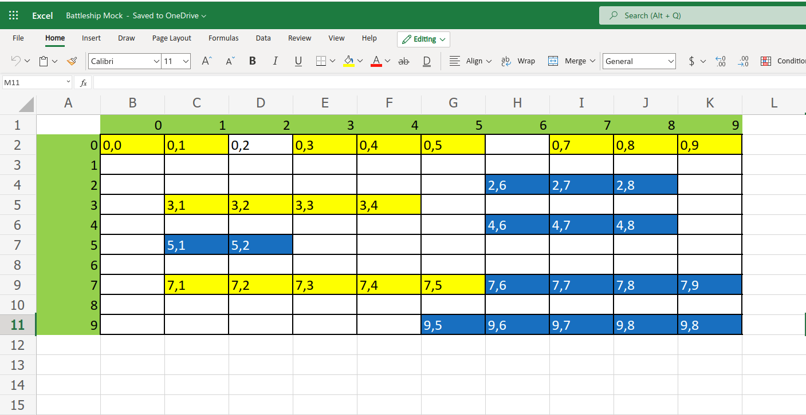

<h1 align="center">Battleship</h1>


<h4 align="center">The classic Battleship game with a modern twist.</h4>
<p align="center"> <a href="https://ec-battleship.netlify.app/">View Live >></a></p>

## Motivation and Story
I wanted to practice my Test Driven Development skills and comfortability with jest. Along with
some higher order function usage practice (such as using the array methods .every(), .some(), etc.). This program pushed my limits in terms of planning
how I would execute my code. I spoke with many developers for insight when I would get stuck
on an issue but ultimately the logic is developed by me.

This program relies heavily on dom manipulation. Adding, removing, and updating elements from the 
webpage throughout the game. This game refined the way I structure my dom creation. Also I improved the way 
I tackled a project. Going step by step piecing together the project to get an end result.

Here's a image of a excel sheet I used to envision how the gameboard would ulimately look as I pieced
it together using a 2-Dimensional Array.



## Code Styles
This project follows the [Airbnb JavaScript Style Guide](https://github.com/airbnb/javascript).

Eslint and Prettier were also used in this project.

Some configurations were applied to .eslintrc.json to prevent styling errors from appearing.
```
{
    "env": {
        "browser": true,
        "es2021": true,
        "jest": true
    },
    "extends": [
        "airbnb-base",
        "prettier"
    ],
    "parserOptions": {
        "ecmaVersion": 13,
        "sourceType": "module"
    },
    "rules": {
        "no-plusplus": [2, { "allowForLoopAfterthoughts": true }],
        "object-curly-newline": "off"
    }
}
```

## Tech Stack
**Built with**
- [Prettier](https://prettier.io/)
- [ESlint](https://eslint.org/)
- [Babel](https://babeljs.io/)
- [Webpack](https://webpack.js.org/)
- [Jest](https://jestjs.io/docs/getting-started)
- [npm](https://www.npmjs.com/)

## Repository Installation
```
$ git clone git@github.com:ec-rilo/battleship-game.git
$ cd battleship-game

$ npm install
```

## Tests
All tests are run using Jest.

To install Jest please follow the [Getting Started Page](https://jestjs.io/docs/getting-started) on the
Jest website.

Once Jest is installed and this project's repository cloned, please type `$ npm run test` in the terminal.
You should now see all tests running as passing.

## Credits
I want to thank my small community of passsionate developers on Discord for giving me feedback on my projects
and always assisting when they can. I also want to thank some members of The Odin Project. All members I spoke
with were very helpful with questions I had about this project without giving out answers. This was a tough project
that pushed my coding limit. None of this would be possible without the help from the people mentioned.

## Contact
**Edgar Carrillo**
</br>
- [Linkedin](https://www.linkedin.com/in/ecarrillo046/)
- [Github](https://github.com/ec-rilo)


<p align="center">Project created by <a href="https://github.com/ec-rilo">Edgar Carrillo</a></p>
